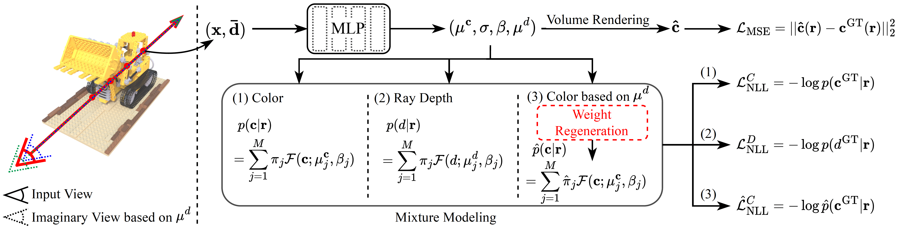

# [CVPR 2023] MixNeRF: Modeling a Ray with Mixture Density for Novel View Synthesis from Sparse Inputs

## [Project Page](https://shawn615.github.io/mixnerf/) | [arXiv](https://arxiv.org/abs/2302.08788)

This repository contains the code release for the CVPR 2023 project [MixNeRF: Modeling a Ray with Mixture Density for Novel View Synthesis from Sparse Inputs](https://shawn615.github.io/mixnerf/).
The code is based on [RegNeRF implementation](https://github.com/google-research/google-research/tree/master/regnerf).
Contact [Seunghyeon Seo](https://shawn615.github.io/) if you have any questions. :)



## About MixNeRF

Neural Radiance Field (NeRF) has broken new ground in the novel view synthesis due to its simple concept and state-of-the-art quality. However, it suffers from severe performance degradation unless trained with a dense set of images with different camera poses, which hinders its practical applications. Although previous methods addressing this problem achieved promising results, they relied heavily on the additional training resources, which goes against the philosophy of sparse-input novel-view synthesis pursuing the training efficiency. In this work, we propose MixNeRF, an effective training strategy for novel view synthesis from sparse inputs by modeling a ray with a mixture density model. Our MixNeRF estimates the joint distribution of RGB colors along the ray samples by modeling it with mixture of distributions. We also propose a new task of ray depth estimation as a useful training objective, which is highly correlated with 3D scene geometry. Moreover, we remodel the colors with regenerated blending weights based on the estimated ray depth and further improves the robustness for colors and viewpoints. Our MixNeRF outperforms other state-of-the-art methods in various standard benchmarks with superior efficiency of training and inference.

**TL;DR:** We model a ray with mixture density model, leading to efficient learning of density distribution with sparse inputs, and propose an effective auxiliary task of ray depth estimation for few-shot novel view synthesis.

## Installation

We recommend to use [Anaconda](https://www.anaconda.com/products/individual) to set up the environment. First, create a new `mixnerf` environment: 

```conda create -n mixnerf python=3.6.15```

Next, activate the environment:

```conda activate mixnerf```

You can then install the dependencies:

```pip install -r requirements.txt```

Finally, install jaxlib with the appropriate CUDA version, e.g. if you have CUDA 11.0:

```
pip install --upgrade pip
pip install --upgrade jaxlib==0.1.68+cuda110 -f https://storage.googleapis.com/jax-releases/jax_cuda_releases.html
```

Note: If you run into problems installing jax, please see [the official documentation](https://github.com/google/jax#pip-installation-gpu-cuda) for additional help.

## Data

Please follow [RegNeRF's data preparation instructions](https://github.com/google-research/google-research/tree/master/regnerf) to prepare the DTU and LLFF datasets.

## Running the code

### Training an new model

For training a new model from scratch, you need to first need to define your CUDA devices. For example, when having access to 4 GPUs, you can run

```export CUDA_VISIBLE_DEVICES=0,1,2,3```

and then you can start the training process by calling

```python train.py --gin_configs configs/{CONFIG} ```

where you replace `{CONFIG}` with the config you want to use. For example, for running an experiment on the LLFF dataset with 3 input views, you would choose the config `llff3.gin`. In the config files, you might need to adjust the `Config.data_dir` argument pointing to your dataset location. For the DTU dataset, you might further need to adjust the `Config.dtu_mask_path` argument.

Once the training process is started, you can monitor the progress via the tensorboard by calling
```
tensorboard --logdir={LOGDIR}
```
and then opening [localhost:6006](http://localhost:6006/) in your browser. `{LOGDIR}` is the path you indicated in your config file for the `Config.checkpoint_dir` argument. 

### Rendering test images

You can render and evaluate test images by running

```python eval.py --gin_configs configs/{CONFIG} ```

where you replace `{CONFIG}` with the config you want to use. Similarly, you can render a camera trajectory (which we used for our videos) by running

```python render.py --gin_configs configs/{CONFIG} ```


### Using a pre-trained model

You can find our pre-trained models, split into the 8 zip folders for the 8 different experimental setups, here: https://drive.google.com/drive/folders/1FvwspZt5AAZnS0C2RPe3SZuR5O152wcT?usp=sharing

After downloading the checkpoints, you need to change the `Config.checkpoint_dir` argument in the respective config file accordingly to use the pre-trained model. You can then render test images or camera trajectories as indicated above.

## Citation

If you find our work useful, please cite it as
```
@InProceedings{Seo_2023_CVPR,
    author    = {Seo, Seunghyeon and Han, Donghoon and Chang, Yeonjin and Kwak, Nojun},
    title     = {MixNeRF: Modeling a Ray With Mixture Density for Novel View Synthesis From Sparse Inputs},
    booktitle = {Proceedings of the IEEE/CVF Conference on Computer Vision and Pattern Recognition (CVPR)},
    month     = {June},
    year      = {2023},
    pages     = {20659-20668}
}
```
*The template is borrowed from the [RegNeRF repository](https://github.com/google-research/google-research/tree/master/regnerf).
